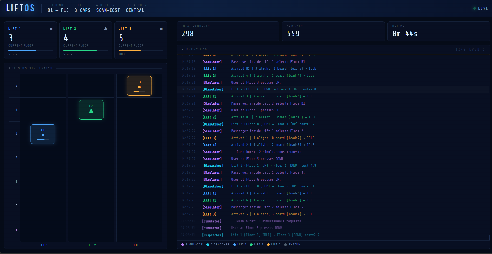

# 🏢 LIFT OS: Multi-Agent Elevator Dispatch Simulation

**Lift OS** is a real-time, event-driven, multi-agent elevator simulation built with **FastAPI**, **Python `asyncio`**, and **WebSockets**. It visualizes a highly optimized dispatch algorithm handling randomized human traffic across a multi-story building.




## 🧠 System Architecture

The architecture is strictly decoupled, ensuring that heavy algorithmic computations do not block the web server.

* **Backend:** Python 3 + FastAPI. Uses `asyncio` to run independent, non-blocking event loops for the Dispatcher, the User Simulator, and the physical movement of each Lift.
* **Frontend:** A Vanilla JS "Mission Control" client.
* **Real-Time Streaming:** A dedicated async broadcast loop pushes the serialized state of the building (JSON) to all connected browser clients via **WebSockets** every 0.25 seconds. No browser refreshes are required.

## 🤖 The Agents

The system relies on two intelligent agents operating concurrently:

### 1. User Behavior Simulator (Agent 1)
Runs in the background and continuously generates realistic building traffic to stress-test the Dispatcher.
* **Traffic Generation:** Simulates both external hall-calls (UP/DOWN) and internal in-cab destination requests.
* **Edge Case Handling:** Enforces constraints (e.g., users at the Basement can only go UP; users on the Top Floor can only go DOWN).
* **Rush Hour:** Introduces randomized bursts of simultaneous requests across different floors.

### 2. Central Dispatcher (Agent 2)
The core optimization brain. It receives requests from the Simulator via a thread-safe `asyncio.Queue` and assigns the most optimal lift.
* **SCAN Algorithm Variant:** Lifts continue in their current direction until all targets are cleared before reversing.
* **Cost Function Assignment:** Calculates a "cost" for each available lift based on **Distance** + **Current Load**. It heavily penalizes sending full lifts or lifts moving in the opposite direction, while rewarding lifts that can pick up passengers "on the way."

## 🚀 Tech Stack
* **Backend:** Python 3.10+, FastAPI, Uvicorn
* **Concurrency:** `asyncio`, WebSockets
* **Frontend:** HTML5, CSS3, Vanilla JavaScript

## 💻 Local Setup & Installation

Follow these steps to run the simulation on your local machine:

**1. Clone the repository:**
```bash
git clone [https://github.com/PrinceKeshri966/agentic-lift-os.git]
cd agentic-lift-os
